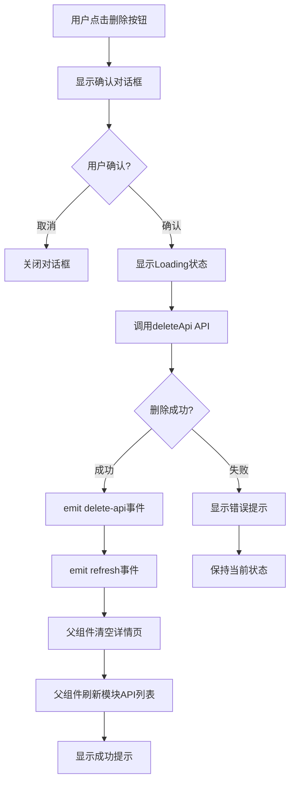

# 接口删除功能实现文档

## 功能概述

在接口详情页面（`ApiDetail.vue`）的"基本信息"标签中实现了"删除接口"功能，允许用户删除不需要的接口。删除接口时会同时删除该接口下的所有测试用例，并提供二次确认以防止误操作。

## 功能特性

### ✅ 已实现功能

1. **删除确认对话框**
   - 显示接口名称
   - 警告删除不可恢复
   - 提示会同时删除该接口下的所有测试用例
   - 危险操作样式（红色按钮）

2. **删除操作**
   - 调用后端 API 删除接口
   - 显示加载状态
   - 完善的错误处理

3. **删除后处理**
   - 清空右侧详情页
   - 刷新左侧树形列表
   - 显示成功提示

4. **用户体验**
   - 删除按钮显示 loading 状态
   - 操作可取消
   - 友好的错误提示

## 实现细节

### 1. API 函数（src/api/project.js）

```javascript
// 删除接口
export function deleteApi(apiId) {
  return request({
    url: `/apis/${apiId}`,
    method: 'delete'
  })
}
```

### 2. ApiDetail 组件修改

#### 导入依赖

```javascript
import { getModulesByProject, updateApi, getProjects, deleteApi } from '@/api/project'
```

#### 添加事件定义

```javascript
const emit = defineEmits([
  'select-case', 
  'edit-case', 
  'delete-case', 
  'delete-api',  // 新增
  'close', 
  'refresh-cases', 
  'refresh'
])
```

#### 删除接口函数

```javascript
/**
 * 删除接口
 */
const handleDelete = async () => {
  try {
    // 获取接口ID和名称
    const apiId = props.api?.api_id || props.api?.id
    const apiName = props.api?.name || '未知接口'
    
    if (!apiId) {
      ElMessage.error('无法获取接口ID')
      return
    }
    
    // 确认对话框
    await ElMessageBox.confirm(
      `确定要删除接口"${apiName}"吗？删除后将无法恢复，且该接口下的所有测试用例也将被删除。`,
      '删除确认',
      {
        confirmButtonText: '确定删除',
        cancelButtonText: '取消',
        type: 'warning',
        confirmButtonClass: 'el-button--danger',
        customClass: 'delete-confirm-dialog'
      }
    )
    
    // 开始删除
    deleteLoading.value = true
    const response = await deleteApi(apiId)
    
    if (response.code === 1) {
      ElMessage.success('接口删除成功')
      
      // 触发父组件刷新并关闭详情页
      emit('delete-api', apiId)
      emit('refresh')
    } else {
      ElMessage.error(response.msg || '删除接口失败')
    }
  } catch (error) {
    // 用户取消操作
    if (error === 'cancel') {
      return
    }
    
    // 错误处理
    if (error.response?.data?.msg) {
      ElMessage.error(error.response.data.msg)
    } else {
      ElMessage.error('删除接口失败，请稍后重试')
    }
  } finally {
    deleteLoading.value = false
  }
}
```

#### 模板（已存在的删除按钮）

```vue
<el-button 
  type="danger" 
  :icon="Delete"
  @click="handleDelete"
  :loading="deleteLoading"
>
  删除用例
</el-button>
```

### 3. Cases 组件修改（src/views/Cases.vue）

#### 添加事件监听

```vue
<ApiDetail
  v-else-if="selectedLevel === 'api'"
  :api="selectedNode"
  :related-cases="selectedNode.cases || []"
  @select-case="handleSelectCase"
  @edit-case="handleEditCase"
  @refresh="handleRefreshApi"
  @delete-api="handleDeleteApi"  <!-- 新增 -->
  @delete-case="handleDeleteCase"
  @refresh-cases="handleRefreshCases"
/>
```

#### 删除处理函数

```javascript
/**
 * 删除接口
 */
const handleDeleteApi = async (apiId) => {
  try {
    console.log('=== 删除接口 ===')
    console.log('接口ID:', apiId)
    
    // 保存当前模块ID，用于刷新
    const currentModuleId = selectedNode.value?.module_id || selectedNode.value?.moduleId
    const currentProjectId = selectedNode.value?.project_id || selectedNode.value?.projectId
    
    // 清空右侧详情页
    selectedNode.value = null
    selectedLevel.value = null
    
    // 刷新模块的API列表
    if (currentModuleId && currentProjectId) {
      console.log('刷新模块的API列表，模块ID:', currentModuleId)
      
      // 在树中找到对应的模块节点并刷新
      const refreshModuleNode = (nodes) => {
        for (const node of nodes) {
          if (node.type === 'module' && (node.moduleId === currentModuleId || node.module_id === currentModuleId)) {
            console.log('找到模块节点，刷新API列表')
            // 重新加载该模块的API列表
            loadModuleApis(node, true)
            return true
          }
          
          if (node.children && node.children.length > 0) {
            if (refreshModuleNode(node.children)) {
              return true
            }
          }
        }
        return false
      }
      
      refreshModuleNode(projectTree.value)
    } else {
      // 如果无法定位模块，则刷新整个项目树
      console.log('无法定位模块，刷新整个项目树')
      await loadProjectTree()
    }
    
    ElMessage.success('接口已删除')
  } catch (error) {
    console.error('删除接口处理失败:', error)
    ElMessage.error('删除接口处理失败')
  }
}
```

## 工作流程

### 删除流程



### 数据流

```
用户点击删除按钮
    ↓
ApiDetail.handleDelete()
    ↓
显示确认对话框（包含接口名称和警告）
    ↓
用户确认
    ↓
deleteLoading = true
    ↓
调用 deleteApi(apiId)
    ↓
DELETE /apis/{apiId}
    ↓
删除成功
    ↓
emit('delete-api', apiId)
emit('refresh')
    ↓
Cases.handleDeleteApi(apiId)
    ↓
清空右侧详情页（selectedNode = null, selectedLevel = null）
    ↓
在树中找到对应模块节点
    ↓
重新加载该模块的API列表
    ↓
显示成功提示
```

## API 接口

### 删除接口

```javascript
DELETE /apis/{apiId}

响应：
{
  "code": 1,
  "msg": "删除成功"
}

错误响应：
{
  "code": -1,
  "msg": "接口不存在"
}
{
  "code": -2,
  "msg": "权限不足"
}
```

## 用户使用流程

### 场景1：删除接口

1. 用户点击左侧树中的某个接口
2. 右侧显示接口详情页
3. 在"基本信息"标签底部，点击红色的"删除用例"按钮
4. 弹出确认对话框，显示：
   - 接口名称
   - 警告：删除后将无法恢复
   - 警告：该接口下的所有测试用例也将被删除
5. 用户点击"确定删除"
6. 按钮显示 loading 状态
7. 删除成功后：
   - 显示"接口删除成功"提示
   - 右侧详情页自动关闭
   - 左侧树形列表自动刷新，接口从列表中移除

### 场景2：取消删除

1. 用户点击删除按钮
2. 弹出确认对话框
3. 用户点击"取消"
4. 对话框关闭，保持当前状态

### 场景3：删除失败

1. 用户点击删除按钮并确认
2. 后端返回错误（如权限不足）
3. 显示错误提示
4. 保持当前状态，用户可以再次尝试或查看详情

## 注意事项

### 1. 数据一致性

- 删除接口会同时删除该接口下的所有测试用例
- 删除操作不可恢复
- 删除后左侧树形列表自动刷新

### 2. 用户体验

- 二次确认防止误操作
- 清晰的警告信息
- Loading 状态反馈
- 友好的错误提示

### 3. 性能优化

- 智能刷新：只刷新相关模块的 API 列表，而不是整个项目树
- 如果无法定位模块，则刷新整个项目树
- 删除后自动清空详情页，避免显示已删除的数据

### 4. 错误处理

- 接口ID不存在时显示错误
- 网络错误显示友好提示
- 权限不足显示相应提示
- 用户取消操作时不显示错误

### 5. 按钮文本

**注意**：当前按钮文本显示"删除用例"，但实际功能是删除接口。建议将按钮文本修改为"删除接口"以避免混淆。

如需修改，更新以下代码：

```vue
<el-button 
  type="danger" 
  :icon="Delete"
  @click="handleDelete"
  :loading="deleteLoading"
>
  删除接口  <!-- 从"删除用例"改为"删除接口" -->
</el-button>
```

## 相关文件

- ✅ `src/api/project.js`
  - 添加了 `deleteApi` 函数
- ✅ `src/components/cases/ApiDetail.vue`
  - 导入 `deleteApi` 函数
  - 添加 `delete-api` 事件到 emit
  - 实现 `handleDelete` 函数（删除接口）
- ✅ `src/views/Cases.vue`
  - 添加 `@delete-api` 事件监听
  - 实现 `handleDeleteApi` 函数
  - 删除旧的简单 `handleDeleteApi` 函数

## 测试建议

### 功能测试

1. ✅ 点击删除按钮，验证确认对话框显示正确
2. ✅ 点击取消，验证对话框关闭且保持当前状态
3. ✅ 点击确定删除，验证删除成功
4. ✅ 验证删除后右侧详情页清空
5. ✅ 验证删除后左侧树形列表刷新
6. ✅ 验证接口从列表中移除

### 边界测试

1. ✅ 删除有测试用例的接口
2. ✅ 删除没有测试用例的接口
3. ✅ 网络错误时的处理
4. ✅ 权限不足时的处理
5. ✅ 接口不存在时的处理

### 性能测试

1. ✅ 删除后刷新速度
2. ✅ 是否正确定位模块节点
3. ✅ 是否避免不必要的整树刷新

## 优化建议

### 1. 按钮文本优化

建议将按钮文本从"删除用例"改为"删除接口"，以准确反映功能。

### 2. 权限控制

可以根据用户权限控制是否显示删除按钮：

```vue
<el-button 
  v-if="hasDeletePermission"
  type="danger" 
  :icon="Delete"
  @click="handleDelete"
  :loading="deleteLoading"
>
  删除接口
</el-button>
```

### 3. 删除前验证

可以在删除前检查接口是否被其他资源引用：

```javascript
// 检查接口是否被测试计划使用
if (api.usedInTestPlans) {
  ElMessage.warning('该接口正在被测试计划使用，无法删除')
  return
}
```

### 4. 软删除

考虑实现软删除（标记为已删除而不是物理删除），以便恢复误删的数据：

```javascript
// 软删除
await updateApi(apiId, { status: 'deleted' })

// 提供恢复功能
ElMessage.success({
  message: '接口已删除',
  showClose: true,
  duration: 5000,
  action: {
    text: '撤销',
    onClick: () => restoreApi(apiId)
  }
})
```

## 总结

本次实现为接口详情页面添加了完整的删除接口功能：

- ✅ 二次确认机制
- ✅ 完善的错误处理
- ✅ 智能刷新机制
- ✅ 良好的用户体验
- ✅ 清晰的警告信息

**关键设计**：删除接口后智能刷新相关模块的 API 列表，而不是刷新整个项目树，保持良好的性能和用户体验。

## 问题修复

### Issue 1: projectTree 变量名错误

**问题描述**：删除成功后报错 `ReferenceError: projectTree is not defined`

**原因**：在 `handleDeleteApi` 函数中使用了错误的变量名 `projectTree.value`，但实际的变量名是 `projects.value`

**修复**：
```javascript
// 修复前
refreshModuleNode(projectTree.value)

// 修复后
refreshModuleNode(projects.value)
```

**状态**：✅ 已修复

### Issue 2: 删除后项目结构没有及时刷新

**问题描述**：删除接口成功后，左侧项目树中仍然显示已删除的接口

**原因**：
1. 调用 `loadModuleApis` 时没有使用 `await` 等待完成
2. 直接修改 `node.apis` 没有触发 Vue 的响应式更新
3. `refreshModuleNode` 不是异步函数，无法正确等待刷新完成

**修复**：
```javascript
// 修复前
const refreshModuleNode = (nodes) => {
  for (const node of nodes) {
    if (node.type === 'module' && ...) {
      loadModuleApis(node, true)  // 没有 await
      return true
    }
    // ...
  }
}
refreshModuleNode(projects.value)  // 没有 await

// 修复后
const refreshModuleNode = async (nodes) => {  // 改为 async
  for (const node of nodes) {
    if (node.type === 'module' && ...) {
      node.apis = []  // 先清空，触发响应式
      await loadModuleApis(node, true)  // 使用 await 等待
      projects.value = [...projects.value]  // 强制触发响应式更新
      return true
    }
    if (node.children && node.children.length > 0) {
      if (await refreshModuleNode(node.children)) {  // 使用 await
        return true
      }
    }
  }
}
const found = await refreshModuleNode(projects.value)  // 使用 await
if (!found) {
  await loadProjectTree()  // 未找到则刷新整个树
}
```

**关键改进**：
1. ✅ 将 `refreshModuleNode` 改为异步函数
2. ✅ 使用 `await` 等待 API 加载完成
3. ✅ 先清空 `node.apis = []` 触发响应式
4. ✅ 使用 `projects.value = [...projects.value]` 强制刷新
5. ✅ 添加未找到模块时的兜底逻辑

**状态**：✅ 已修复

### Issue 3: 删除后项目结构折叠状态重置

**问题描述**：删除接口成功后，左侧项目树刷新时恢复了原始折叠状态，展开的节点全部折叠

**原因**：
使用 `loadModuleApis` 重新加载整个模块的 API 列表，会重建树的结构，导致展开状态丢失

**修复**：
参考编辑接口时的刷新机制（`updateCurrentApiData`），直接在树结构中找到并移除对应的接口节点，而不是重新加载

```javascript
// 修复前（会重建树结构，丢失展开状态）
const refreshModuleNode = async (nodes) => {
  for (const node of nodes) {
    if (node.type === 'module' && ...) {
      node.apis = []
      await loadModuleApis(node, true)  // 重新加载整个模块
      projects.value = [...projects.value]
      return true
    }
  }
}
await refreshModuleNode(projects.value)

// 修复后（直接操作树节点，保持展开状态）
let found = false
projects.value.forEach(project => {
  if (project.modules) {
    project.modules.forEach(module => {
      if (module.apis && Array.isArray(module.apis)) {
        const apiIndex = module.apis.findIndex(api => 
          (api.api_id || api.id) === apiId
        )
        if (apiIndex !== -1) {
          // 直接从数组中移除该接口
          module.apis.splice(apiIndex, 1)
          found = true
        }
      }
    })
  }
})
```

**关键改进**：
1. ✅ 不再调用 `loadModuleApis` 重新加载
2. ✅ 直接使用 `Array.splice()` 移除接口节点
3. ✅ 保持树的结构不变，展开状态不受影响
4. ✅ 与编辑接口时的刷新机制一致

**状态**：✅ 已修复

### Issue 4: 删除后右侧仍显示旧的项目信息

**问题描述**：删除接口成功后，右侧详情页仍然显示着删除前选中的项目或模块信息

**原因**：
1. 设置 `selectedNode.value = null` 和 `selectedLevel.value = null` 后，没有调用 `savePageState()` 更新 localStorage
2. Vue 的响应式更新可能没有及时触发，导致 DOM 没有立即更新

**修复**：
```javascript
// 修复前
selectedNode.value = null
selectedLevel.value = null
// 没有保存状态，没有等待 DOM 更新

// 修复后
selectedNode.value = null
selectedLevel.value = null

// 等待 DOM 更新，确保右侧详情页被清空
await nextTick()

// 保存清空后的状态到 localStorage
savePageState()
```

**关键改进**：
1. ✅ 添加 `nextTick` 导入
2. ✅ 在清空选择状态后调用 `await nextTick()` 确保 DOM 更新
3. ✅ 调用 `savePageState()` 更新 localStorage 中的状态
4. ✅ 确保右侧详情页被立即清空

**状态**：✅ 已修复

### Issue 5: 删除后出现 "Cannot read properties of null" 错误

**问题描述**：删除接口后，控制台报错 `Cannot read properties of null (reading 'name')`，提示 `LevelStats` 组件收到了 null 的 node prop

**错误信息**：
```
[Vue warn]: Invalid prop: type check failed for prop "node". Expected Object, got Null
Uncaught (in promise) TypeError: Cannot read properties of null (reading 'name')
```

**原因**：
在某些情况下（如状态恢复、快速操作等），`selectedLevel` 有值但 `selectedNode` 是 null，导致组件渲染时收到无效的 props

**修复**：
在所有组件的 `v-if` 条件中添加 `selectedNode` 的检查

```vue
<!-- 修复前 -->
<LevelStats
  v-if="selectedLevel === 'project' || selectedLevel === 'module'"
  :node="selectedNode"
  ...
/>

<ApiDetail
  v-else-if="selectedLevel === 'api'"
  :api="selectedNode"
  ...
/>

<CaseDetail
  v-else-if="selectedLevel === 'case'"
  :test-case="selectedNode"
  ...
/>

<!-- 修复后 -->
<LevelStats
  v-if="(selectedLevel === 'project' || selectedLevel === 'module') && selectedNode"
  :node="selectedNode"
  ...
/>

<ApiDetail
  v-else-if="selectedLevel === 'api' && selectedNode"
  :api="selectedNode"
  ...
/>

<CaseDetail
  v-else-if="selectedLevel === 'case' && selectedNode"
  :test-case="selectedNode"
  ...
/>
```

**关键改进**：
1. ✅ 在所有组件的 `v-if` 条件中添加 `&& selectedNode` 检查
2. ✅ 确保只有当 `selectedNode` 不是 null 时才渲染组件
3. ✅ 当条件都不满足时，显示默认空状态
4. ✅ 防止组件收到 null props 导致的运行时错误

**状态**：✅ 已修复

## 更新时间
2025-01-24 (最后更新: 2025-01-24)

