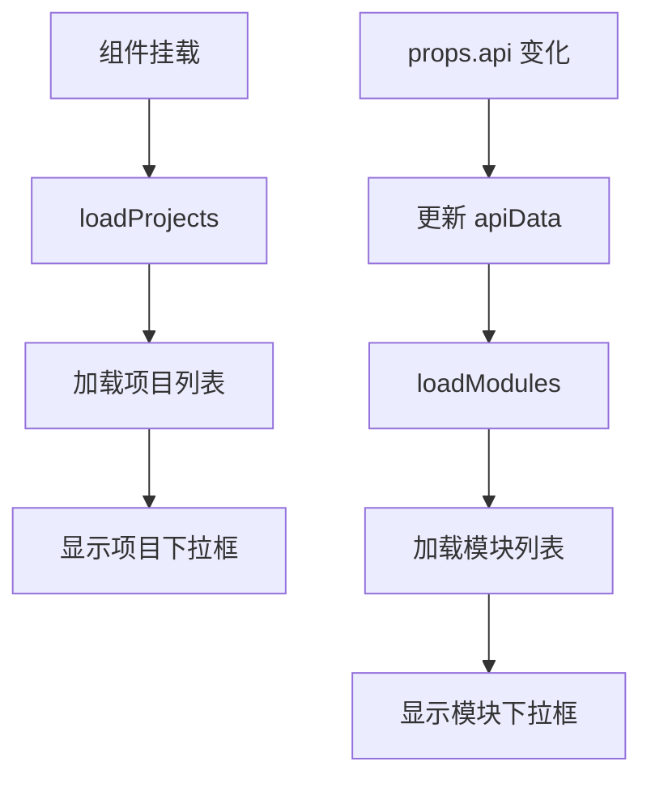
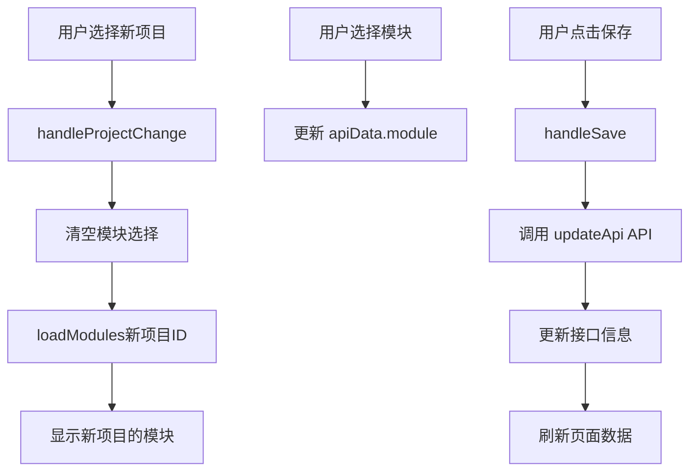

# 接口详情页面项目选择功能实现文档

## 功能概述

在接口详情页面（`ApiDetail.vue`）的"基本信息"标签中实现了"所属项目"的动态选择功能，允许用户查看和修改接口所属的项目，并自动加载对应项目下的模块列表。

## 功能特性

### ✅ 已实现功能

1. **动态加载项目列表**
   - 组件挂载时自动加载所有项目
   - 下拉框显示所有可用项目

2. **智能模块联动**
   - 选择项目后自动加载该项目下的模块
   - 切换项目时清空当前模块选择
   - 防止模块选择错误

3. **加载状态显示**
   - 项目加载时显示 loading 状态
   - 模块加载时显示 loading 状态
   - 空状态提示

4. **数据保存**
   - 支持修改接口所属项目
   - 支持修改接口所属模块
   - 自动更新关联关系

## 实现细节

### 1. 导入依赖

```javascript
import { getModulesByProject, updateApi, getProjects } from '@/api/project'
```

### 2. 状态管理

```javascript
// 项目和模块相关状态
const availableProjects = ref([])
const projectsLoading = ref(false)
const availableModules = ref([])
const modulesLoading = ref(false)
```

### 3. 数据结构

```javascript
const apiData = reactive({
  project: '',      // 项目名称（显示用）
  projectId: null,  // 项目ID（保存用）
  module: '',       // 模块名称（显示用）
  moduleId: null,   // 模块ID（保存用）
  name: '',
  path: '',
  method: 'GET',
  description: '',
  // ... 其他字段
})
```

### 4. 加载项目列表

```javascript
const loadProjects = async () => {
  try {
    projectsLoading.value = true
    const response = await getProjects()
    
    if (response.code === 1 && response.data) {
      const projects = response.data.items || response.data || []
      availableProjects.value = projects.map(project => ({
        id: project.project_id || project.projectId || project.id,
        name: project.name || project.projectName || '未命名项目'
      }))
    }
  } catch (error) {
    ElMessage.error('加载项目列表失败')
  } finally {
    projectsLoading.value = false
  }
}
```

### 5. 加载模块列表（支持动态项目ID）

```javascript
const loadModules = async (projectId = null) => {
  // 如果没有传入projectId，则从 apiData 或 props.api 获取
  const targetProjectId = projectId || apiData.projectId || props.api?.project_id || props.api?.projectId
  
  if (!targetProjectId) {
    availableModules.value = []
    return
  }
  
  try {
    modulesLoading.value = true
    const response = await getModulesByProject(targetProjectId, {
      structure: 'tree',
      status: 'active'
    })
    
    if (response.code === 1 && response.data) {
      // 扁平化树形结构
      availableModules.value = flattenModules(modulesData)
    }
  } catch (error) {
    ElMessage.error('加载模块列表失败')
  } finally {
    modulesLoading.value = false
  }
}
```

### 6. 项目改变处理

```javascript
const handleProjectChange = (projectId) => {
  console.log('项目改变:', projectId)
  
  // 清空模块选择
  apiData.module = ''
  apiData.moduleId = null
  availableModules.value = []
  
  // 加载新项目下的模块
  if (projectId) {
    loadModules(projectId)
  }
}
```

### 7. 监听器设置

```javascript
// 组件挂载时加载项目列表
onMounted(() => {
  loadProjects()
})

// 监听 apiData.projectId 变化，重新加载模块列表
watch(
  () => apiData.projectId,
  (newProjectId, oldProjectId) => {
    if (newProjectId && newProjectId !== oldProjectId) {
      loadModules(newProjectId)
    }
  }
)

// 监听API变化，更新表单数据
watch(
  () => props.api,
  (newApi) => {
    if (newApi) {
      apiData.project = newApi.project_name || newApi.projectName || '-'
      apiData.projectId = newApi.project_id || newApi.projectId
      apiData.module = newApi.module_name || newApi.moduleName || '-'
      apiData.moduleId = newApi.module_id || newApi.moduleId
      // ... 其他字段
    }
  },
  { immediate: true }
)
```

### 8. 模板更新

#### 修改前
```vue
<div class="form-section">
  <div class="section-title">所属项目</div>
  <el-select v-model="apiData.project" placeholder="请选择项目" class="form-select">
    <el-option label="电商支付系统" value="电商支付系统" />
  </el-select>
</div>
```

#### 修改后
```vue
<div class="form-section">
  <div class="section-title">所属项目</div>
  <el-select 
    v-model="apiData.projectId" 
    placeholder="请选择项目" 
    class="form-select"
    v-loading="projectsLoading"
    @change="handleProjectChange"
  >
    <el-option 
      v-for="project in availableProjects" 
      :key="project.id"
      :label="project.name" 
      :value="project.id"
    />
  </el-select>
  <div class="form-tip" v-if="availableProjects.length === 0 && !projectsLoading">
    暂无可用项目
  </div>
</div>
```

## 工作流程

### 1. 初始化流程



### 2. 用户操作流程



## 数据流

### 1. 项目数据流

```
后端 /projects API
    ↓
getProjects()
    ↓
availableProjects = [{id, name}, ...]
    ↓
<el-select v-model="apiData.projectId">
    ↓
handleProjectChange(projectId)
    ↓
loadModules(projectId)
```

### 2. 模块数据流

```
后端 /projects/{projectId}/modules API
    ↓
getModulesByProject(projectId)
    ↓
availableModules = [{id, name, level}, ...]
    ↓
<el-select v-model="apiData.module">
    ↓
handleSave()
    ↓
updateApi(apiId, { module_id: moduleId })
```

## API 接口

### 1. 获取项目列表

```javascript
GET /projects

响应：
{
  "code": 1,
  "msg": "查询成功",
  "data": {
    "items": [
      {
        "project_id": 1,
        "name": "PAMC Exchange Platform",
        "description": "..."
      }
    ]
  }
}
```

### 2. 获取项目下的模块

```javascript
GET /projects/{projectId}/modules?structure=tree&status=active

响应：
{
  "code": 1,
  "msg": "查询成功",
  "data": {
    "modules": [
      {
        "module_id": 1,
        "name": "认证模块",
        "children": [...]
      }
    ]
  }
}
```

### 3. 更新接口

```javascript
PUT /apis/{apiId}

请求体：
{
  "moduleId": 2,  // 新的模块ID
  "name": "用户登录",
  "method": "POST",
  "path": "/api/auth/login",
  // ... 其他字段
}

响应：
{
  "code": 1,
  "msg": "更新成功",
  "data": { ... }
}
```

## 用户使用流程

### 场景1：查看接口所属项目

1. 用户点击左侧树中的某个接口
2. 右侧显示接口详情页
3. "基本信息"标签中显示"所属项目"下拉框
4. 下拉框中显示当前接口所属的项目

### 场景2：修改接口所属项目

1. 用户点击"所属项目"下拉框
2. 选择不同的项目（例如从"项目A"改为"项目B"）
3. "所属模块"下拉框自动清空并刷新
4. 显示"项目B"下的所有模块
5. 用户选择新的模块
6. 点击"保存修改"按钮
7. 系统更新接口的项目和模块关联
8. 显示"保存成功"提示

### 场景3：只修改模块

1. 用户保持项目不变
2. 只修改"所属模块"
3. 点击"保存修改"
4. 系统只更新模块关联

## 注意事项

### 1. 数据一致性

- 项目ID和模块ID必须匹配（模块必须属于所选项目）
- 切换项目时必须清空模块选择
- 保存时验证模块是否属于所选项目

### 2. 用户体验

- 加载时显示 loading 状态
- 空状态显示友好提示
- 操作后及时反馈

### 3. 性能优化

- 项目列表只在组件挂载时加载一次
- 模块列表按需加载（切换项目时）
- 使用 watch 避免重复加载

### 4. 错误处理

- 网络错误显示错误提示
- API 错误显示具体错误信息
- 数据为空显示友好提示

## 相关文件

- ✅ `src/components/cases/ApiDetail.vue` - 接口详情组件
  - 添加了项目选择功能
  - 优化了模块加载逻辑
  - 添加了项目改变处理
- ✅ `src/api/project.js` - API 函数
  - 已有 `getProjects` 函数
  - 已有 `getModulesByProject` 函数
  - 已有 `updateApi` 函数

## 测试建议

### 功能测试

1. ✅ 打开接口详情页，验证项目下拉框显示正确
2. ✅ 点击项目下拉框，验证显示所有项目
3. ✅ 切换项目，验证模块列表自动更新
4. ✅ 选择新模块并保存，验证更新成功
5. ✅ 保存后验证左侧树中的接口位置变化

### 边界测试

1. ✅ 项目列表为空时的处理
2. ✅ 模块列表为空时的处理
3. ✅ 网络错误时的处理
4. ✅ 保存失败时的处理

### 性能测试

1. ✅ 加载时间是否合理
2. ✅ 切换项目时的响应速度
3. ✅ 是否有重复请求

## 总结

本次实现为接口详情页面添加了完整的项目选择功能：

- ✅ 动态加载项目列表
- ✅ 项目和模块的联动
- ✅ 智能数据清空和刷新
- ✅ 完善的加载状态和错误处理
- ✅ 良好的用户体验

**关键设计**：使用 projectId 而非项目名称作为选择值，确保数据的准确性和一致性。

## 更新时间
2025-01-24


