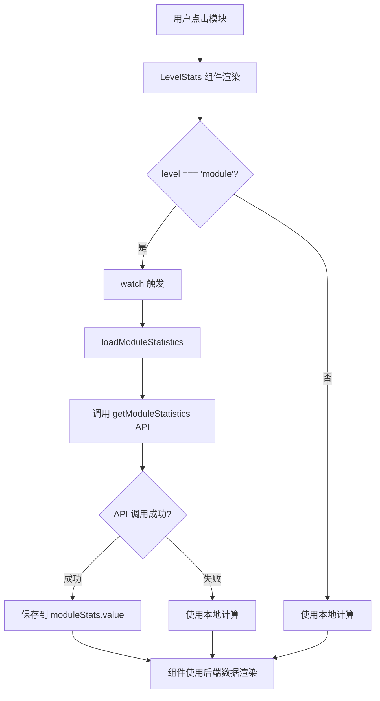

# 模块统计数据功能实现文档

## 功能概述

在模块详情页面（`LevelStats.vue` 组件）中集成后端的模块统计API，显示更准确和完整的模块统计信息，包括接口数、用例数、通过率、执行记录等。

## 功能特性

### ✅ 已实现功能

1. **调用后端统计API**
   - 自动调用 `/modules/{moduleId}/statistics` 接口
   - 获取模块的完整统计数据
   - 支持数据自动刷新

2. **智能数据显示**
   - 模块层级：使用后端统计数据（更准确）
   - 降级处理：后端数据加载失败时使用本地计算

3. **响应式更新**
   - 监听模块节点变化
   - 自动重新加载统计数据
   - 无需手动刷新

4. **完整的统计指标**
   - 接口总数
   - 用例总数
   - 通过的用例数
   - 失败的用例数
   - 未执行的用例数
   - 子模块总数
   - 执行记录总数
   - 用例通过率

## 实现细节

### 1. 后端 API

#### 接口定义
```java
@GetMapping("/{moduleId}/statistics")
@GlobalInterceptor(checkLogin = true)
public ResponseVO<ModuleStatisticsDTO> getModuleStatistics(
    @PathVariable("moduleId") Integer moduleId
)
```

#### 响应数据结构
```java
@Data
public class ModuleStatisticsDTO {
    private Integer moduleId;              // 模块ID
    private String moduleName;             // 模块名称
    private String moduleCode;             // 模块编码
    private Integer apiCount;              // 接口总数
    private Integer testCaseCount;         // 用例总数
    private Integer passedCount;           // 通过的用例数
    private Integer failedCount;           // 失败的用例数
    private Integer notExecutedCount;      // 未执行的用例数
    private Integer childModuleCount;      // 子模块总数
    private Integer executionRecordCount;  // 执行记录总数
    private Double passRate;               // 用例通过率
    private String lastExecutionTime;      // 最近一次执行时间
    private String status;                 // 模块状态
    private String createdAt;              // 模块创建时间
    private String updatedAt;              // 模块最后更新时间
}
```

### 2. 前端 API 函数（src/api/project.js）

```javascript
/**
 * 获取模块统计数据
 * @param {number} moduleId - 模块ID
 * @returns {Promise} 包含统计数据的响应
 */
export function getModuleStatistics(moduleId) {
  return request({
    url: `/modules/${moduleId}/statistics`,
    method: 'get'
  })
}
```

### 3. LevelStats 组件修改

#### 导入依赖
```javascript
import { getProjectStatistics, getModuleStatistics } from '@/api/project'
```

#### 添加响应式状态
```javascript
// 模块统计数据
const moduleStats = ref(null)
const loadingModuleStats = ref(false)
```

#### 加载统计数据函数
```javascript
const loadModuleStatistics = async () => {
  if (props.level !== 'module' || !props.node) return
  
  const moduleId = props.node.module_id || props.node.moduleId || props.node.id
  if (!moduleId) {
    console.warn('无法获取模块ID')
    return
  }
  
  try {
    loadingModuleStats.value = true
    console.log('开始加载模块统计数据，模块ID:', moduleId)
    
    const response = await getModuleStatistics(moduleId)
    
    if (response.code === 1 && response.data) {
      moduleStats.value = response.data
      console.log('模块统计数据已加载:', moduleStats.value)
    } else {
      console.error('获取模块统计数据失败:', response.msg)
    }
  } catch (error) {
    console.error('加载模块统计数据失败:', error)
  } finally {
    loadingModuleStats.value = false
  }
}
```

#### 监听节点变化
```javascript
watch(
  () => props.node,
  (newNode) => {
    if (newNode) {
      if (props.level === 'project') {
        loadProjectStatistics()
      } else if (props.level === 'module') {
        loadModuleStatistics()  // 新增模块统计加载
      }
    }
  },
  { immediate: true }
)
```

#### 智能统计数据获取
```javascript
const getChildCount = () => {
  // 如果是项目层级且有统计数据，使用后端数据
  if (props.level === 'project' && projectStats.value) {
    return projectStats.value.moduleCount || 0
  }
  // 如果是模块层级且有统计数据，使用后端数据
  if (props.level === 'module' && moduleStats.value) {
    return moduleStats.value.apiCount || 0
  }
  return children.value.length
}

const getTotalCases = () => {
  // 项目层级
  if (props.level === 'project' && projectStats.value) {
    return projectStats.value.testCaseCount || 0
  }
  // 模块层级
  if (props.level === 'module' && moduleStats.value) {
    return moduleStats.value.testCaseCount || 0
  }
  
  // 本地计算
  // ...
}

// 类似的模式应用于其他统计函数
```

## 工作流程

### 数据加载流程



### 统计数据获取策略

```
getChildCount() for module
    ↓
level === 'module' && moduleStats.value?
    ↓
YES → 返回 moduleStats.value.apiCount
    ↓
NO → 返回 children.value.length (本地计算)
```

## API 请求和响应

### 请求示例
```http
GET /modules/1/statistics HTTP/1.1
Authorization: Bearer <token>
```

### 响应示例
```json
{
  "code": 1,
  "msg": "查询模块统计数据成功",
  "data": {
    "moduleId": 1,
    "moduleName": "认证模块",
    "moduleCode": "AUTH",
    "apiCount": 12,
    "testCaseCount": 45,
    "passedCount": 38,
    "failedCount": 5,
    "notExecutedCount": 2,
    "childModuleCount": 0,
    "executionRecordCount": 120,
    "passRate": 84.44,
    "lastExecutionTime": "2025-01-24 15:20:00",
    "status": "active",
    "createdAt": "2025-10-19 10:45:00",
    "updatedAt": "2025-01-24 14:10:00"
  }
}
```

## 用户使用流程

### 场景1：查看模块统计

1. 用户点击左侧树中的某个模块
2. 右侧显示模块详情页（LevelStats 组件）
3. 组件自动调用后端统计API
4. 显示统计卡片：
   - 📊 接口数：12
   - 📝 用例总数：45
   - ✓ 通过：38
   - ✗ 失败：5
   - ⊙ 未执行：2

### 场景2：切换模块

1. 用户点击另一个模块
2. watch 监听到 props.node 变化
3. 自动重新加载新模块的统计数据
4. 更新显示

### 场景3：项目-模块切换

1. 用户先点击项目，显示项目统计
2. 再点击该项目下的某个模块
3. watch 检测到 level 变化
4. 从项目统计切换到模块统计
5. 调用对应的 API 加载数据

## 数据优先级

### 模块层级统计数据来源优先级

1. **后端统计数据**（最高优先级）
   - `moduleStats.value` 存在时使用
   - 数据更准确、更完整
   - 包含数据库聚合计算的结果

2. **本地计算数据**（降级方案）
   - 后端数据加载失败时使用
   - 基于当前已加载的接口节点计算
   - 可能不完整（未加载的接口不会被计算）

## 统计数据对照表

| 统计项 | 项目层级 | 模块层级 | 数据来源 |
|--------|----------|----------|----------|
| 子项数 | 模块数 | 接口数 | 后端API |
| 用例总数 | 所有用例 | 模块下用例 | 后端API |
| 通过数 | 所有通过 | 模块下通过 | 后端API |
| 失败数 | 所有失败 | 模块下失败 | 后端API |
| 未执行数 | 所有未执行 | 模块下未执行 | 后端API |

## 注意事项

### 1. 数据一致性

- 后端统计数据是实时从数据库聚合的
- 本地计算只基于已加载的节点，可能不完整
- 推荐使用后端统计数据作为权威数据源

### 2. 性能优化

- 统计数据在组件挂载时自动加载
- 节点变化时自动重新加载
- 避免重复加载（通过 watch 的 immediate 选项控制）

### 3. 错误处理

- API 调用失败时不显示错误提示，静默降级到本地计算
- 控制台输出错误信息便于调试
- 用户体验平滑，无感知降级

### 4. 与项目统计的一致性

- 项目和模块统计使用相同的逻辑模式
- 统计函数都支持两个层级的后端数据
- 代码结构一致，易于维护

## 相关文件

- ✅ `src/api/project.js`
  - 添加了 `getModuleStatistics` 函数
- ✅ `src/components/cases/LevelStats.vue`
  - 导入了 `getModuleStatistics` API
  - 添加了 `moduleStats` 和 `loadingModuleStats` 状态
  - 实现了 `loadModuleStatistics` 函数
  - 修改了 watch 监听器支持模块层级
  - 修改了所有统计函数以支持模块后端数据

## 测试建议

### 功能测试

1. ✅ 点击模块，验证统计数据是否正确显示
2. ✅ 切换到不同模块，验证数据是否更新
3. ✅ 查看控制台，验证API是否被正确调用
4. ✅ 从项目切换到模块，验证数据切换是否正确
5. ✅ 对比后端数据和显示的数据是否一致

### 边界测试

1. ✅ 模块没有任何接口时的显示
2. ✅ 模块没有任何用例时的显示
3. ✅ 网络错误时的降级处理
4. ✅ API 返回错误时的处理
5. ✅ 模块ID不存在时的处理

### 性能测试

1. ✅ 首次加载速度
2. ✅ 切换模块时的响应速度
3. ✅ 是否有重复的API调用
4. ✅ 项目-模块切换时的性能

## 对比：项目统计 vs 模块统计

| 特性 | 项目统计 | 模块统计 |
|------|----------|----------|
| API端点 | `/projects/{id}/statistics` | `/modules/{id}/statistics` |
| 子项计数 | `moduleCount` | `apiCount` |
| 特有字段 | `memberCount`, `testReportCount` | `childModuleCount` |
| 加载时机 | level === 'project' | level === 'module' |
| 状态变量 | `projectStats` | `moduleStats` |
| 加载函数 | `loadProjectStatistics` | `loadModuleStatistics` |

## 优化建议

### 1. 统一数据结构

可以考虑统一项目和模块的统计数据结构，使用一个通用的 `stats` 对象：

```javascript
const stats = computed(() => {
  if (props.level === 'project') return projectStats.value
  if (props.level === 'module') return moduleStats.value
  return null
})

const getTotalCases = () => {
  if (stats.value) return stats.value.testCaseCount || 0
  // 本地计算...
}
```

### 2. 添加缓存机制

类似项目统计，可以添加缓存避免频繁请求：

```javascript
const moduleStatsCache = new Map()

const loadModuleStatistics = async () => {
  const moduleId = props.node.module_id || props.node.moduleId
  
  if (moduleStatsCache.has(moduleId)) {
    moduleStats.value = moduleStatsCache.get(moduleId)
    return
  }
  
  // ... 加载数据
  moduleStatsCache.set(moduleId, moduleStats.value)
}
```

### 3. 添加刷新按钮

允许用户手动刷新统计数据：

```vue
<el-button 
  v-if="level === 'module'"
  size="small" 
  :icon="Refresh"
  @click="loadModuleStatistics"
  :loading="loadingModuleStats"
>
  刷新统计
</el-button>
```

## 总结

本次实现为模块详情页面添加了完整的后端统计数据集成：

- ✅ 调用后端统计API获取准确数据
- ✅ 智能降级到本地计算
- ✅ 响应式数据更新
- ✅ 良好的用户体验
- ✅ 完善的错误处理
- ✅ 与项目统计保持一致的实现模式

**关键设计**：优先使用后端统计数据，降级时使用本地计算，确保用户始终能看到统计信息。项目和模块统计使用相同的实现模式，代码结构一致，易于维护和扩展。

## 更新时间
2025-01-24


