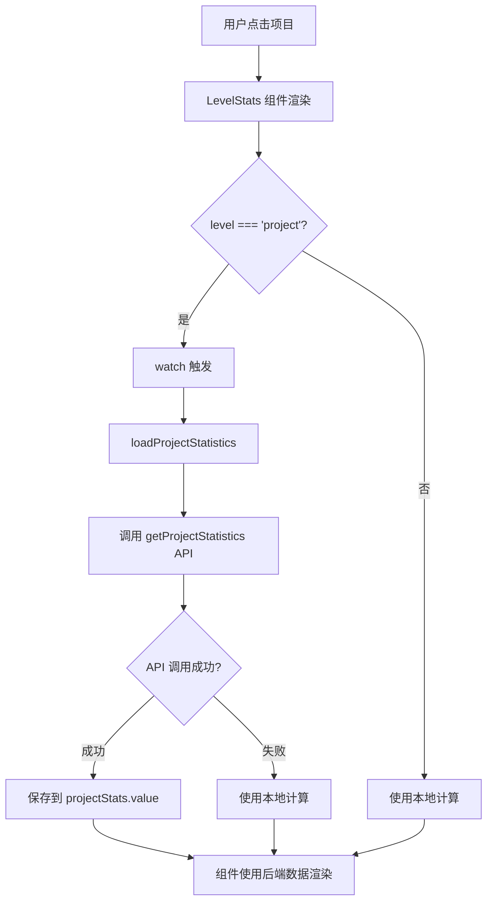

# 项目统计数据功能实现文档

## 功能概述

在项目详情页面（`LevelStats.vue` 组件）中集成后端的项目统计API，显示更准确和完整的项目统计信息，包括模块数、用例数、通过率、执行记录等。

## 功能特性

### ✅ 已实现功能

1. **调用后端统计API**
   - 自动调用 `/projects/{projectId}/statistics` 接口
   - 获取项目的完整统计数据
   - 支持数据自动刷新

2. **智能数据显示**
   - 项目层级：使用后端统计数据（更准确）
   - 模块层级：使用本地计算数据
   - 降级处理：后端数据加载失败时使用本地计算

3. **响应式更新**
   - 监听项目节点变化
   - 自动重新加载统计数据
   - 无需手动刷新

4. **完整的统计指标**
   - 模块总数
   - 用例总数
   - 通过的用例数
   - 失败的用例数
   - 未执行的用例数
   - 接口总数
   - 执行记录总数
   - 用例通过率

## 实现细节

### 1. 后端 API

#### 接口定义
```java
@GetMapping("/{projectId}/statistics")
@GlobalInterceptor(checkLogin = true)
public ResponseVO<ProjectStatisticsDTO> getProjectStatistics(
    @PathVariable("projectId") Integer projectId
)
```

#### 响应数据结构
```java
@Data
public class ProjectStatisticsDTO {
    private Integer projectId;           // 项目ID
    private String projectName;          // 项目名称
    private String projectCode;          // 项目编码
    private Integer moduleCount;         // 模块总数
    private Integer testCaseCount;       // 用例总数
    private Integer passedCount;         // 通过的用例数
    private Integer failedCount;         // 失败的用例数
    private Integer notExecutedCount;    // 未执行的用例数
    private Integer apiCount;            // 接口总数
    private Integer executionRecordCount; // 执行记录总数
    private Integer testReportCount;     // 测试报告总数
    private Integer memberCount;         // 项目成员总数
    private Double passRate;             // 用例通过率
    private String lastExecutionTime;    // 最近一次执行时间
    private String createdAt;            // 项目创建时间
    private String updatedAt;            // 项目最后更新时间
}
```

### 2. 前端 API 函数（src/api/project.js）

```javascript
/**
 * 获取项目统计数据
 * @param {number} projectId - 项目ID
 * @returns {Promise} 包含统计数据的响应
 */
export function getProjectStatistics(projectId) {
  return request({
    url: `/projects/${projectId}/statistics`,
    method: 'get'
  })
}
```

### 3. LevelStats 组件修改

#### 导入依赖
```javascript
import { computed, ref, onMounted, watch } from 'vue'
import { getProjectStatistics } from '@/api/project'
import { ElMessage } from 'element-plus'
```

#### 添加响应式状态
```javascript
// 项目统计数据
const projectStats = ref(null)
const loadingStats = ref(false)
```

#### 加载统计数据函数
```javascript
const loadProjectStatistics = async () => {
  if (props.level !== 'project' || !props.node) return
  
  const projectId = props.node.project_id || props.node.projectId || props.node.id
  if (!projectId) {
    console.warn('无法获取项目ID')
    return
  }
  
  try {
    loadingStats.value = true
    console.log('开始加载项目统计数据，项目ID:', projectId)
    
    const response = await getProjectStatistics(projectId)
    
    if (response.code === 1 && response.data) {
      projectStats.value = response.data
      console.log('项目统计数据已加载:', projectStats.value)
    } else {
      console.error('获取项目统计数据失败:', response.msg)
    }
  } catch (error) {
    console.error('加载项目统计数据失败:', error)
  } finally {
    loadingStats.value = false
  }
}
```

#### 监听节点变化
```javascript
watch(
  () => props.node,
  (newNode) => {
    if (newNode && props.level === 'project') {
      loadProjectStatistics()
    }
  },
  { immediate: true }
)
```

#### 智能统计数据获取
```javascript
const getChildCount = () => {
  // 如果是项目层级且有统计数据，使用后端数据
  if (props.level === 'project' && projectStats.value) {
    return projectStats.value.moduleCount || 0
  }
  return children.value.length
}

const getTotalCases = () => {
  // 如果是项目层级且有统计数据，使用后端数据
  if (props.level === 'project' && projectStats.value) {
    return projectStats.value.testCaseCount || 0
  }
  
  // 否则使用本地计算
  // ... 本地计算逻辑
}

const getPassedCount = () => {
  // 如果是项目层级且有统计数据，使用后端数据
  if (props.level === 'project' && projectStats.value) {
    return projectStats.value.passedCount || 0
  }
  
  // 否则使用本地计算
  // ... 本地计算逻辑
}

// 类似的模式应用于其他统计函数
```

## 工作流程

### 数据加载流程



### 统计数据获取策略

```
getChildCount()
    ↓
level === 'project' && projectStats.value?
    ↓
YES → 返回 projectStats.value.moduleCount
    ↓
NO → 返回 children.value.length
```

## API 请求和响应

### 请求示例
```http
GET /projects/1/statistics HTTP/1.1
Authorization: Bearer <token>
```

### 响应示例
```json
{
  "code": 1,
  "msg": "查询项目统计数据成功",
  "data": {
    "projectId": 1,
    "projectName": "PAMC Exchange Platform",
    "projectCode": "PAMC001",
    "moduleCount": 14,
    "testCaseCount": 156,
    "passedCount": 120,
    "failedCount": 20,
    "notExecutedCount": 16,
    "apiCount": 89,
    "executionRecordCount": 350,
    "testReportCount": 25,
    "memberCount": 8,
    "passRate": 76.92,
    "lastExecutionTime": "2025-01-24 14:30:00",
    "createdAt": "2025-10-19 10:40:00",
    "updatedAt": "2025-01-24 12:35:00"
  }
}
```

## 用户使用流程

### 场景1：查看项目统计

1. 用户点击左侧树中的某个项目
2. 右侧显示项目详情页（LevelStats 组件）
3. 组件自动调用后端统计API
4. 显示统计卡片：
   - 📊 模块数：14
   - 📝 用例总数：156
   - ✓ 通过：120
   - ✗ 失败：20
   - ⊙ 未执行：16

### 场景2：切换项目

1. 用户点击另一个项目
2. watch 监听到 props.node 变化
3. 自动重新加载新项目的统计数据
4. 更新显示

### 场景3：模块层级

1. 用户点击某个模块
2. `level === 'module'`
3. 使用本地计算的统计数据（因为模块层级暂不调用后端API）
4. 显示该模块下的接口和用例统计

## 数据优先级

### 项目层级统计数据来源优先级

1. **后端统计数据**（最高优先级）
   - `projectStats.value` 存在时使用
   - 数据更准确、更完整
   - 包含数据库聚合计算的结果

2. **本地计算数据**（降级方案）
   - 后端数据加载失败时使用
   - 基于当前已加载的树节点计算
   - 可能不完整（未加载的节点不会被计算）

### 模块层级统计数据来源

- **仅使用本地计算**
  - 基于模块下已加载的接口和用例
  - 实时计算，无需API调用

## 注意事项

### 1. 数据一致性

- 后端统计数据是实时从数据库聚合的
- 本地计算只基于已加载的节点，可能不完整
- 推荐使用后端统计数据作为权威数据源

### 2. 性能优化

- 统计数据在组件挂载时自动加载
- 节点变化时自动重新加载
- 避免重复加载（通过 watch 的 immediate 选项控制）

### 3. 错误处理

- API 调用失败时不显示错误提示，静默降级到本地计算
- 控制台输出错误信息便于调试
- 用户体验平滑，无感知降级

### 4. 扩展性

可以轻松添加更多统计指标：
- 修改后端 DTO 添加新字段
- 在前端添加对应的显示逻辑
- 无需修改核心流程

## 相关文件

- ✅ `src/api/project.js`
  - 添加了 `getProjectStatistics` 函数
- ✅ `src/components/cases/LevelStats.vue`
  - 导入了 `getProjectStatistics` API
  - 添加了 `projectStats` 和 `loadingStats` 状态
  - 实现了 `loadProjectStatistics` 函数
  - 添加了 watch 监听器
  - 修改了所有统计函数以支持后端数据

## 测试建议

### 功能测试

1. ✅ 点击项目，验证统计数据是否正确显示
2. ✅ 切换到不同项目，验证数据是否更新
3. ✅ 查看控制台，验证API是否被正确调用
4. ✅ 点击模块，验证模块层级的统计计算
5. ✅ 对比后端数据和显示的数据是否一致

### 边界测试

1. ✅ 项目没有任何模块时的显示
2. ✅ 项目没有任何用例时的显示
3. ✅ 网络错误时的降级处理
4. ✅ API 返回错误时的处理
5. ✅ 项目ID不存在时的处理

### 性能测试

1. ✅ 首次加载速度
2. ✅ 切换项目时的响应速度
3. ✅ 是否有重复的API调用
4. ✅ 大量数据时的性能表现

## 优化建议

### 1. 缓存统计数据

可以考虑缓存已加载的统计数据，避免频繁请求：

```javascript
const statsCache = new Map()

const loadProjectStatistics = async () => {
  const projectId = props.node.project_id || props.node.projectId || props.node.id
  
  // 检查缓存
  if (statsCache.has(projectId)) {
    projectStats.value = statsCache.get(projectId)
    return
  }
  
  // ... 加载数据
  
  // 保存到缓存
  statsCache.set(projectId, projectStats.value)
}
```

### 2. 添加刷新按钮

允许用户手动刷新统计数据：

```vue
<el-button 
  size="small" 
  :icon="Refresh"
  @click="loadProjectStatistics"
  :loading="loadingStats"
>
  刷新统计
</el-button>
```

### 3. 显示加载状态

在统计卡片区域显示加载状态：

```vue
<div class="stats-cards" v-loading="loadingStats">
  <!-- 统计卡片 -->
</div>
```

### 4. 支持模块统计API

如果后端提供了模块统计API，可以类似地集成：

```javascript
const loadModuleStatistics = async () => {
  if (props.level !== 'module' || !props.node) return
  
  const moduleId = props.node.module_id || props.node.moduleId
  const response = await getModuleStatistics(moduleId)
  // ... 处理响应
}
```

## 总结

本次实现为项目详情页面添加了完整的后端统计数据集成：

- ✅ 调用后端统计API获取准确数据
- ✅ 智能降级到本地计算
- ✅ 响应式数据更新
- ✅ 良好的用户体验
- ✅ 完善的错误处理
- ✅ 易于扩展和维护

**关键设计**：优先使用后端统计数据，降级时使用本地计算，确保用户始终能看到统计信息。

## 更新时间
2025-01-24

